<!-- Animated Header Banner -->

<!-- Typing Animation -->

 

<!-- Social Badges -->

---

<!-- ABOUT ME -->

### 🧠 Who Am I?

  

 

- &nbsp;I'm a Computer Science undergraduate who builds at the intersection of **Full-stack engineering and applied AI** not just connecting APIs to frontends, but architecting systems where retrieval, reasoning, and real-time web interfaces work as one.
- &nbsp;I've shipped multi-tenant SaaS platforms, hybrid RAG pipelines evaluated at **85%+ relevancy**, and LangGraph-orchestrated agentic workflows all production-grade, all from scratch. My stack spans LangChain, FastAPI, Next.js, and vector databases, and I bring the same engineering discipline to backend APIs as I do to LLM prompt design and retrieval strategy.
- &nbsp;I'm graduating in 2026 and actively targeting roles where I can work on hard AI-integrated products the kind that require both strong web engineering fundamentals and genuine understanding of how LLMs behave in production.

 

| &nbsp; | &nbsp; |
|:---|:---|
| 🔭 &nbsp;**Currently** | Shipping a production-grade AI compliance B2B SaaS |
| 🌱 &nbsp;**Learning** | Docker · Kubernetes · CI/CD |
| 💡 &nbsp;**DSA** | 250+ problems — LeetCode · GFG · CodeChef |
| 🤝 &nbsp;**Open to** | Full-Stack · AI Engineering · Web+AI Integration roles |

---

## ⚡ Tech Arsenal

### 🖥️ Frontend

### ⚙️ Backend

### 🗄️ Databases

### 🤖 AI / LLM Stack

### 🛠️ Tools & Platforms

---

## 🚀 Featured Projects

| 🔬 Project | 💡 What It Does | 🛠️ Stack |
|:---|:---|:---|
| [**⚖️ LegalRAG-Engine**](https://github.com/RISHABH-PAWAR/LegalRAG-Engine) | Hybrid BM25 + FAISS RAG pipeline with 85%+ response relevancy. Routes 100+ queries across 3 adaptive strategies with multi-turn memory. | Python · LangChain · FAISS · FastAPI · React · RAGAS |
| [**🏢 AI Compliance Copilot**](https://github.com/RISHABH-PAWAR/Compliance-copilot) | Multi-tenant SaaS detecting labor law gaps. 4-stage LangGraph workflow with AES-256 encryption, JWT + RBAC, and JSON-enforced audit reports. | LangGraph · Pinecone · FastAPI · React · MongoDB |
| [**🌾 AgriContractor**](https://github.com/RISHABH-PAWAR/AgriContractor) | Full-stack contract farming platform with 3 role-based dashboards, 15+ REST APIs, digital contracts, and live deployment. | Next.js · Node.js · MongoDB · Docker · Vercel |
| [**✍️ Signature Injection Engine**](https://github.com/RISHABH-PAWAR/Signature-Injection-Enginejs) | Prototype that burns browser-placed signature fields into PDFs at pixel-perfect positions, device-agnostic. | JavaScript · PDF Processing |
| [**📄 Resume Builder AI**](https://github.com/RISHABH-PAWAR/Resume-Builder) | MERN stack resume builder with AI-enhanced templates and customization. | React · Node.js · MongoDB |

---

## 📊 GitHub Stats

---

## 🏆 Achievements

| &nbsp; | Achievement |
|:---:|:---|
| 🎓 | **Deep Learning Certification** — NVIDIA Deep Learning Institute 2024 |
| 🎓 | **Python Programming** — IIT Madras Research Park 2024 |
| 💡 | **250+ DSA Problems** — LeetCode · GFG · CodeChef (Arrays, Trees, DP, Graphs) |
| 🎤 | **Technical Quiz Organizer** — Campus-wide contest at IMSEC 2025 |

---

## 🎯 What I'm Building Toward

```mermaid
graph LR
    A[⚡ Now] -->|Building| B[Full-Stack AI SaaS Products]
    A -->|Mastering| C[LangGraph · RAG · Multi-Agent]
    A -->|Learning| D[Docker · Kubernetes · CI/CD]
    B --> E[🎯 Target Role]
    C --> E
    D --> E
    E --> F[Full-Stack Engineer]
    E --> G[AI / LLM Engineer]
    E --> H[Web + AI Integration]
```

---

## 📬 Let's Connect

> *"I don't just write code — I architect systems that think."*

**Open to:** Full-Stack Roles · AI Engineering · Web + AI Integration · High-Impact Startups

<!-- Footer Wave -->

